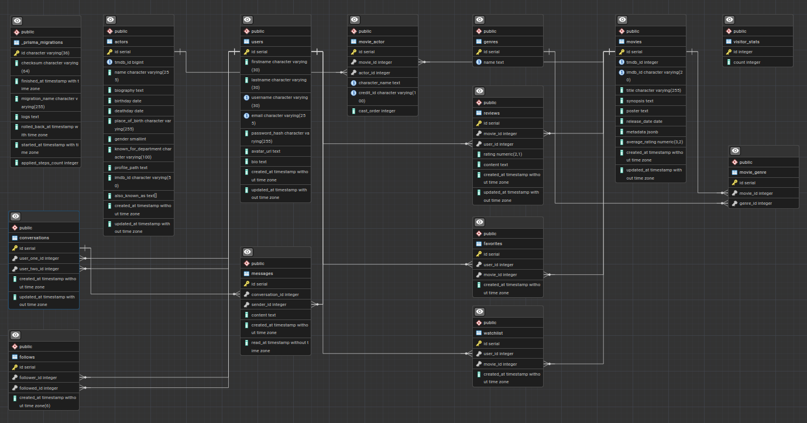

*This project has been created as part of the 42 curriculum by naankour, ilhasnao, mpinguet, zamohame, cmontaig.*

# Transcendance

## Description

**Transcendance** is a social movie-tracking web application, developed as a team project following the 42 school's **ft_transcendence** subject. It takes the Letterboxd concept — logging, rating and discovering films — and layers a nostalgic early-2000s/y2k blog aesthetic on top of it, putting more emphasis on social relationships than a typical film-logging site: follows, friends' activity, and a real-time chat between users.

**Key features:**

* Account registration/login (email + password, with a strong-password policy) as well as Google and GitHub OAuth login
* User profiles: editable bio, avatar upload or default avatar selection, public profile pages
* Follow / followers system, with online status shown for other users
* Movie browsing, actor pages, genre pages
* Reviews and ratings, favorites list, watchlist
* A "Discover" page to search and filter movies, plus a global site search with a results page
* Real-time private messaging between users (WebSockets)
* Personalized homepage: friends' activity feed, latest reviews, a "daily recommendation", and a visitor counter
* Multi-language interface (French, English, Spanish)

## Instructions

### Prerequisites

* Docker & Docker Compose
* `make`
* A `.env` file at the project root (see `.env.example`), containing at minimum:

  * `POSTGRES_DB`, `POSTGRES_USER`, `POSTGRES_PASSWORD`
  * `DATABASE_URL` (Prisma connection string to the Postgres service)
  * `JWT_SECRET`
  * `TMDB_API_KEY` (used to seed the movie/actor database from TMDB)
  * `GOOGLE_CLIENT_ID` / `GOOGLE_CLIENT_SECRET` and `GITHUB_CLIENT_ID` / `GITHUB_CLIENT_SECRET` (OAuth login)

### Running the project

```bash
git clone https://github.com/naankour/Transcendance.git

cd Transcendance

cp .env.example .env   # then fill in the values above

make
```

`make` runs `docker compose up --build` and starts five containers:

| Service    | Role                           | Local access          |
| ---------- | ------------------------------ | --------------------- |
| `nginx`    | Reverse proxy / entry point    | https://localhost     |
| `frontend` | React app (Vite dev server)    | http://localhost:5173 |
| `backend`  | Express API + WebSocket server | http://localhost:3000 |
| `database` | PostgreSQL 16                  | localhost:5432        |
| `pgadmin`  | DB admin UI                    | http://localhost:5050 |

Other Makefile commands:

```bash
make clean   # stop the containers, keep the database volume
make fclean  # full reset: removes containers, volumes and images
make re      # fclean + all
```

## Team Information

| Member       | Responsibilities                                                                                                                                        |
| ------------ | ------------------------------------------------------------------------------------------------------------------------------------------------------- |
| **naankour** | Bootstrapped the backend and set up the Docker infrastructure; owns follows/followers and reviews (API/controller); built the reviews and follows pages |
| **ilhasnao** | Genres feature (API/controller); Discover page (search & filtering); chat module (WebSockets)                                                           |
| **mpinguet** | Films feature (API/controller); Films page; some frontend support to ilhasnao                                                                           |
| **zamohame** | Users feature (API/controller); authentication (incl. OAuth) and profile system: avatar upload, password management, profile editing                    |
| **cmontaig** | Actors feature (API/controller), homepage modules, header/footer, global search + search results page, site translation (i18next)                       |

## Team Roles

| Members       | Roles
| ---------------------------------------------------------------------------------------------------------------------------------------------------------------------- |
| **naankour**  | Developer + Technical Lead / Architect — bootstrapped the backend, set up the Docker infrastructure, and made the main technical/architecture decisions. (Express, Prisma, PostgreSQL, container setup)                                                                                                                                                                  
| **ilhasnao**  | Developer
| **mpinguet**  | Developer
| **zamohame**  | Developer
| **cmontaig**  | Developer      

No single member was formally assigned as Product Owner or Project Manager. Coordination tasks typically handled by those roles (e.g. scheduling meetings) were instead made collectively — the team used surveys/polls to agree on meeting times, and organized work as a group rather than through a dedicated PM.

## Project Management

* **Task distribution:** naankour bootstrapped the shared backend and Docker setup; afterwards the team split ownership of the API by resource (actors, films, genres, users, follows/reviews), with each member handling that resource's controller, routes and matching frontend pages end-to-end.
* **Meetings:** The team worked mostly remotely, with about one sync meeting per week over Discord.
* **Project management tools:** A GitHub board (To Do / In Progress / Done) directly on the repository.
* **Communication channels:** Mainly a WhatsApp group for day-to-day communication, plus Discord for calls.

## Technical Stack

### Frontend

* **React 19** with **TypeScript**, built with **Vite**
* **React Router** for client-side navigation
* **i18next / react-i18next** for the multi-language interface (fr, en, es)
* **axios** for HTTP requests, **jwt-decode** to read the auth token client-side
* **socket.io-client** for real-time chat and online-status updates

### Backend

* **Node.js** with **Express 5**
* **Prisma** as ORM, with **PostgreSQL** as the database
* **jsonwebtoken** + **bcryptjs** for authentication and password hashing
* **validator** for input validation (email format, password strength)
* **multer** for avatar image uploads
* **socket.io** for the WebSocket server (chat, online status)
* Google and GitHub OAuth login alongside classic email/password auth

### Infrastructure

* **Docker Compose**, orchestrating `nginx`, `frontend`, `backend`, `database` (Postgres) and `pgadmin`
* **Nginx** as the reverse proxy / single entry point (HTTPS on port 443)
* A Prisma seed script populates the database with initial movie/actor data from **TMDB**

**Why these choices:**

* **PostgreSQL + Prisma:** the data model is heavily relational (users, movies, reviews, favorites, watchlist, follows, conversations), and Prisma gives typed, migration-tracked access to it — useful for a team new to backend/SQL work.
* **Express over a more opinionated framework:** kept the learning curve manageable for a team mostly new to web development.
* **Socket.IO:** provides real-time chat and live online/offline status without needing a custom WebSocket protocol.
* **TMDB seed:** provides an initial movie and actor dataset locally, avoiding the need to rely on TMDB for every movie-related request at runtime.

## Database Schema

Managed with PostgreSQL via Prisma. Main tables and relationships:

```text
users ──┬── reviews ──────── movies
        ├── favorites ────── movies
        ├── watchlist ────── movies
        ├── follows (follower_id / followed_id) ── users
        ├── conversations (user_one_id / user_two_id) ── users
        │     └── messages (sender_id → users)
        └── visitor_stats (global counter, not user-linked)

movies ──┬── movie_actor ── actors
         └── movie_genre ── genres
```

| Table                         | Key fields                                                                  | Notes                                                      |
| ----------------------------- | --------------------------------------------------------------------------- | ---------------------------------------------------------- |
| `users`                       | id, username (unique), email (unique), password_hash, avatar_url, bio       | `password_hash` is nullable to support OAuth-only accounts |
| `movies`                      | id, tmdb_id, imdb_id, title, synopsis, poster, release_date, average_rating | Seeded from TMDB                                           |
| `actors`                      | id, tmdb_id, name, biography, birthday, place_of_birth                      |                                                            |
| `genres`                      | id, name (unique)                                                           |                                                            |
| `movie_actor` / `movie_genre` | join tables                                                                 | link movies to actors/genres                               |
| `reviews`                     | user_id, movie_id, rating, content                                          | one review per user/movie (unique constraint)              |
| `favorites` / `watchlist`     | user_id, movie_id                                                           | one entry per user/movie (unique constraint)               |
| `follows`                     | follower_id, followed_id                                                    | one follow relationship per pair (unique constraint)       |
| `conversations`               | user_one_id, user_two_id                                                    | one conversation per user pair                             |
| `messages`                    | conversation_id, sender_id, content, read_at                                |                                                            |
| `visitor_stats`               | single-row counter                                                          | powers the homepage visitor counter                        |



The diagram above shows all tables and their foreign key relationships, generated via pgAdmin's ERD tool.

## Features List

| Feature               | Description                                                                                               | Contributor(s)                |
| --------------------- | --------------------------------------------------------------------------------------------------------- | ----------------------------- |
| Authentication        | Register/login with a strong-password policy, plus Google and GitHub OAuth login                          | zamohame                      |
| Profile management    | Bio editing, avatar upload or default-avatar picker, public profile pages                                 | zamohame                      |
| Online status         | Shows whether another user is currently connected (tracked via WebSocket connections)                     | ilhasnao                      |
| Actors                | Actor pages and actor data                                                                                | cmontaig                      |
| Genres                | Genre pages and genre data                                                                                | ilhasnao                      |
| Films                 | Film pages and film data                                                                                  | mpinguet                      |
| Reviews               | Review API (routes/controller), personal reviews page                                                     | naankour                      |
| Reviews               | Review creation, editing and deletion on movie pages; ratings;                                            | mpinguet                      |
| Follows / Followers   | Follow/unfollow, followers list, follow-related pages and buttons                                         | naankour                      |
| Favorites & Watchlist | Add/remove movies to a favorites list or a watchlist                                                      | naankour                      |
| Discover              | Search & filter movies on a dedicated page                                                                | ilhasnao                      |
| Global search         | Site-wide search bar + results page                                                                       | cmontaig                      |
| Chat                  | Real-time private messaging between users                                                                 | ilhasnao                      |
| Homepage              | Friends' activity feed, latest reviews, daily recommendation, visitor counter, navigation (header/footer) | cmontaig                      |
| Translation           | French / English / Spanish interface                                                                      | cmontaig                      |

## Modules

The project must total **14 points minimum** (Major = 2pts, Minor = 1pt), with up to **5 bonus points** for validated modules beyond that. Final module selection for this project:

### Core modules (14 points)

|   **Module**    | **Type** | **Points** | **Contributor(s)** | **Notes**                                                                                                                                                                                                                                                       |
| :----------------------------------- | :-------: | :--------: | :----------------------------------------------------- | :-------------------------------------------------------------------------------------------------------------------------------------------------------------------------------------------------------------------------------------------------------------- |
| **Framework — Frontend & Backend**   | **Major** |    **2**   | **Team**                                               | **React** (frontend) + **Express** (backend)                                                                                                                                                                                                                    |
| **Public API**                       | **Major** |    **2**   | **naankour/zamohame ?**                                     | Public API with **secured API key**, **rate limiting**, **documentation**, and **5+ endpoints** using GET/POST/PUT/DELETE                                                                                                                                       |
| **ORM**                              | **Minor** |    **1**   | **?**                                               | **Prisma**                                                                                                                                                                                                                                                      |
| **Real-time features**               | **Major** |    **2**   | **ilhasnao**                                           | **Socket.IO** — connection/disconnection handling and message broadcasting                                                                                                                                                                                      |
| **User interaction**                 | **Major** |    **2**   | **ilhasnao** (basic chat)<br>**zamohame** (profile system) | **Basic chat** + **profile system** + **follow/follower system**
| **Advanced search**                  | **Minor** |    **1**   | **ilhasnao, cmontaig**                                 | **Discover filters** + **global search**                                                                                                           |
| **User management & authentication** | **Major** |    **2**   | **zamohame**                                           | **Profile editing**, **avatar upload** with default avatar, **friends' online status**, and **profile page**                                                                                                                                                    |
| **Custom design system**             | **Minor** |    **1**   | **Team**                                           | **10+ reusable components** with a custom **retro/Y2K visual identity**, including palette, typography and icons                                                                                                                                                |
| **Additional browser support** | **Minor** | **1** | **Team** | Manually tested on **Firefox, Safari and Edge** — no browser-specific errors found |

**Subtotal: 14 points**

### Bonus modules

| **Module**                               |  **Type** | **Points** | **Contributor(s)** | **Notes**                                                                                          |
| :--------------------------------------- | :-------: | :--------: | :----------------- | :------------------------------------------------------------------------------------------------- |
| **Complete notification system**         | **Minor** |    **1**   | **?**           | Toast notifications (`notification.tsx`) — confirmed to cover all creation/update/deletion actions |
| **Multiple languages (3+)**              | **Minor** |    **1**   | **cmontaig**       | **French / English / Spanish** via i18next                                                         |
| **Remote authentication with OAuth 2.0** | **Minor** |    **1**   | **zamohame**       | **Google and GitHub OAuth**                                                                        |

**Grand total if all validated: 17 points** (14 core + 3 bonus)

## Individual Contributions

### naankour

* Bootstrapped most of the backend early on and set up the Docker Compose infrastructure.
* Owns follows/followers and reviews on the backend (API, controllers) and their frontend pages.
* **Challenges faced:** [TODO]

### cmontaig

* Owns actors on the backend (API, controller).
* Built the homepage modules, header, footer, global search bar and search results page.
* Implemented the i18next-based translation system (fr/en/es).
* **Challenges faced:** Implementing global search across several different entity types (movies, actors, users) at once was tricky — each type has its own shape and its own backend endpoint, so the search logic had to query and merge results consistently rather than just calling one endpoint. Retrofitting i18next across the application was heavier than expected: since all the components had already been written with hardcoded text, it meant going back through every existing file to extract and replace strings with translation keys, rather than building it in from the start. The homepage also required combining data pulled from several different endpoints (friends' activity, latest reviews, daily recommendation, visitor count) into one coherent view without the page feeling slow or inconsistent.

### ilhasnao

* Owns genres on the backend (API, controller).
* Built the Discover page (movie search & filtering).
* Built the real-time chat module (Socket.IO).
* **Challenges faced:** Correcting different errors from different members from a distance, finding solutions to avoid API's problems (not being able to load more than 500 pages, movies without posters, movie duplicates). Learning new language through what a colleague did. Correcting git merges. Learning new concepts without a 42 project.

### mpinguet

* Owns films on the backend (API, controller).
* Built the Films page.
* Gave some frontend support to ilhasnao. [TODO: confirm specifics]
* **Challenges faced:** [TODO]

### zamohame

* Owns users on the backend (API, controller).
* Built the authentication system, including Google/GitHub OAuth, avatar upload and password management.
* **Challenges faced:** [TODO]

## Resources

* [Letterboxd](https://letterboxd.com/) — main source of inspiration for the film-logging concept
* [TMDB API documentation](https://developer.themoviedb.org/docs) — source of the movie/actor seed data
* [Prisma documentation](https://www.prisma.io/docs)
* [Express documentation](https://expressjs.com/)
* [Socket.IO documentation](https://socket.io/docs/v4/)
* [i18next documentation](https://www.i18next.com/)

**AI usage:**

AI tools were used as development and debugging assistance throughout the project, including:

* Debugging React and TypeScript issues.
* Understanding and resolving Git errors and merge-related issues.
* Debugging frontend/backend integration issues.
* Reviewing and improving the README and other project documentation.
* Brainstorming ideas for certain UI features and improvements.
* Identifying possible causes of HTTP and WebSocket errors.

## Known Limitations

* Real-time features such as private messaging and online status rely on an active WebSocket connection and therefore require a stable network connection.
* The application depends on external services such as TMDB, so their availability and response time can affect movie-related features.
* The project is intended primarily for local deployment and demonstration as part of the 42 curriculum rather than as a production-ready service.
* The initial database seed provides sample users, reviews, follows and other social data to make the application immediately usable after installation. This data is intended for demonstration and testing purposes.

## License / Credits

[TODO]
